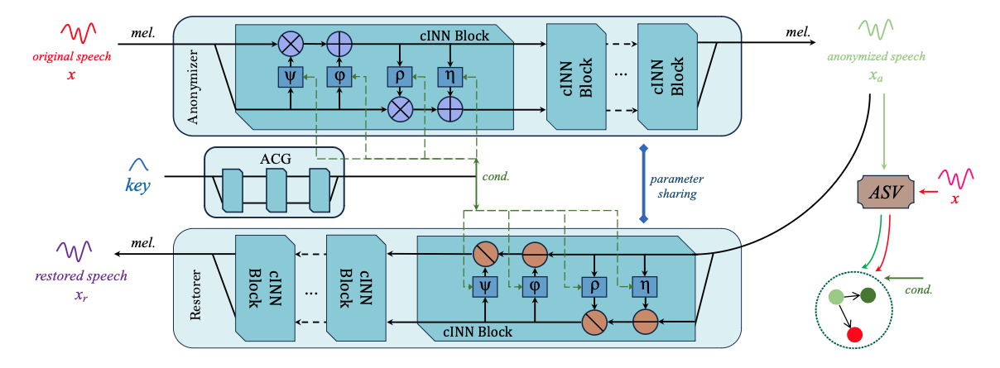
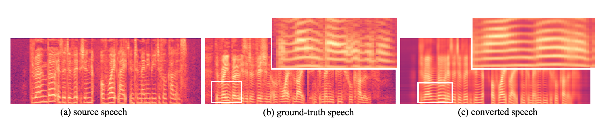
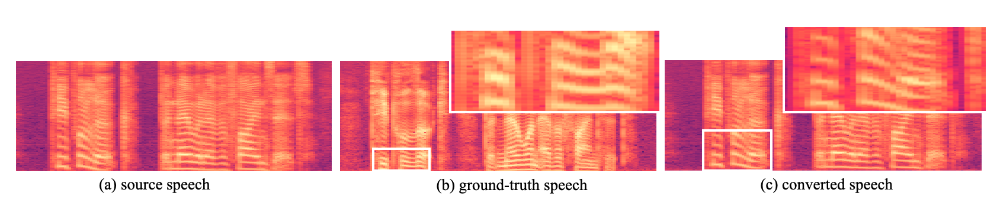
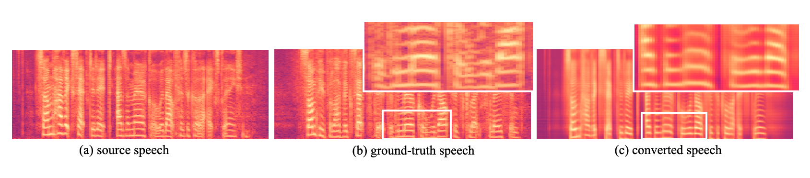

# Rano

## Abstract

## Overview

Figure.1 The Architecture of Rano

&nbsp;
 

## Audio Samples in Speaker Anonymization Tasks

<table>
	<CAPTION>Table.1 Traditional Voice Conversion (seen speakers)</CAPTION>
    <tr>
        <th>  </th>
	<th> Source </th>
        <th> Target </th>
        <th> Baseline </th>
	<th> MAIN-VC </th>
    </tr>
<tr>
        <th> F2F </th>
	<th> <audio controls id="player" onplay="pauseOthers(this);"><source src="assets/s2s_raw/p228_154.mp3" type="audio/mpeg"></audio> </th>
        <th> <audio controls id="player" onplay="pauseOthers(this);"><source src="assets/s2s_raw/p233_025.mp3" type="audio/mpeg"></audio> </th>
        <th> <audio controls id="player" onplay="pauseOthers(this);"><source src="assets/ADAINVC/s2s/p228_154_p233_025.mp3" type="audio/mpeg"></audio> </th>
        <th> <audio controls id="player" onplay="pauseOthers(this);"><source src="assets/MAINVC/s2s/F2Fp228_154_p233_025.mp3" type="audio/mpeg"></audio> </th>
</tr>
	
<tr>
        <th> M2M </th>
	<th> <audio controls id="player" onplay="pauseOthers(this);"><source src="assets/s2s_raw/p374_070.mp3" type="audio/mpeg"></audio> </th>
        <th> <audio controls id="player" onplay="pauseOthers(this);"><source src="assets/s2s_raw/p286_028.mp3" type="audio/mpeg"></audio> </th>
        <th> <audio controls id="player" onplay="pauseOthers(this);"><source src="assets/ADAINVC/s2s/p374_070_p286_028.mp3" type="audio/mpeg"></audio> </th>
        <th> <audio controls id="player" onplay="pauseOthers(this);"><source src="assets/MAINVC/s2s/M2Mp374_070_p286_028.mp3" type="audio/mpeg"></audio> </th>
</tr>

<tr>
        <th> F2M </th>
	<th> <audio controls id="player" onplay="pauseOthers(this);"><source src="assets/s2s_raw/p313_300.mp3" type="audio/mpeg"></audio> </th>
        <th> <audio controls id="player" onplay="pauseOthers(this);"><source src="assets/s2s_raw/p363_041.mp3" type="audio/mpeg"></audio> </th>
        <th> <audio controls id="player" onplay="pauseOthers(this);"><source src="assets/ADAINVC/s2s/p313_300_p363_041.mp3" type="audio/mpeg"></audio> </th>
        <th> <audio controls id="player" onplay="pauseOthers(this);"><source src="assets/MAINVC/s2s/F2Mp313_300_p363_041.mp3" type="audio/mpeg"></audio> </th>
</tr>
    
<tr>
        <th> M2F </th>
	<th> <audio controls id="player" onplay="pauseOthers(this);"><source src="assets/s2s_raw/p270_234.mp3" type="audio/mpeg"></audio> </th>
        <th> <audio controls id="player" onplay="pauseOthers(this);"><source src="assets/s2s_raw/p265_148.mp3" type="audio/mpeg"></audio> </th>
        <th> <audio controls id="player" onplay="pauseOthers(this);"><source src="assets/ADAINVC/s2s/p270_234_p265_148.mp3" type="audio/mpeg"></audio> </th>
        <th> <audio controls id="player" onplay="pauseOthers(this);"><source src="assets/MAINVC/s2s/M2Fp270_234_p265_148.mp3" type="audio/mpeg"></audio> </th>
</tr>	
</table>

&nbsp;
 

## Mel-Spectrogram Samples in One-shot VC

Figure.2 VC task "<i>The rainbow is a division of white light into many beautiful colors.</i>"

Figure.3 VC task "<i>People look, but no one finds it.</i>"

Figure.4 VC task "<i>Some have accepted it as a miracle without physical explanation.</i>"

&nbsp;
 

&nbsp;
 

